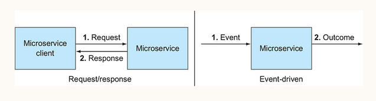
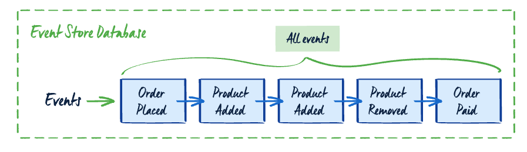

# Event sourcing vs Event Driven architecture

In the [previous post](https://kkhanhluu.github.io/what-is-cloud-native/), we already clarified the difference between "cloud-native" and "microservices architecture". In this post, we will clarify the difference between two popular concepts that people often conflate with each other: "**Event sourcing**" and "**Event Driven architecture**".

# Event Driven Architecture

**Event driven architecture** is about using events to implement communication between services asynchronously. **Using events** and **asynchronous communication** are two main characteristics of this architecture

### Communication via events

In an **event driven architecture**, an “event” is an occurrence of something (a state change). A “Publisher” publishes events describing something happened within the service (User logged in, Order was checked out). A “Consumer” subscribes to published events and react to them (Update database, sending email when order was checked out).

### Event driven architecture communicate asynchronously

In a normal case, the client calls the service via REST API, GraphQL or RPC. This is a common pattern for synchronous communication called **Request-Response pattern**, where the client has to wait for a full response from the service.

In an **event driven architecture**, publishers publish events and subscribers react to those events and ublishers don’t expect any immediate response after publishing events. This picture below, taken from the book [“Cloud native patterns”](https://www.manning.com/books/cloud-native-patterns) depicts the contrast between the primitive request/response and event-driven invocation styles

There are two interesting points to note in the diagram:

- In **event driven architecture**, the client and the service itself are loosely coupled. The service executes as a result of an event, but it doesn’t care who triggered that event
- The event and the outcome are totaly disconnected. In the primitive request/response, there’s a couping between request and response.

# Event sourcing

In many cases, we don’t just want to see the current state of data, but also want to track the complete series of action taken of that data. A real-world example is a bank system, where as an end-user, we may need to replay the complete history of transactions that happened within our account, besides just seeing the current balance.

In a tradditonal database, we usually only save the final state of data, business operation context is usually lost. Event sourcing is an alternative pattern for storing data as events. In the context of event sourcing, an event represents a change that took place within your business. Every change made is stored in the event database. An entity's current state can be created by replaying all the events in the order of occurrence.

Here’s an [example](https://www.eventstore.com/event-sourcing) of events in an event sourcing system

### Projection

In an **event sourcing** system, each change that took place in the system is recorded in the database and this event store is the signle source of truth. However, in many cases, developers need a way to view or query the data like the powerful queries in SQL or NoSQL database. A `projection` provides a view of underlying event-based data model. Often, the present the logic of translating the event-based data into a read model. This read model can be stored in any databases (SQL, NoSQL,…) and used for queries.

If you to look at a example of event sourcing, you can visit my [e-shop project](https://kkhanhluu.github.io/e-shop/explore/code/event-sourcing).

# Conclusion

**Event driven architecture** is about using events to implement communication between services asynchronously. **Event sourcing** is pattern for storing data as events. We can use both solutions next to each other but conflate those two concepts.
