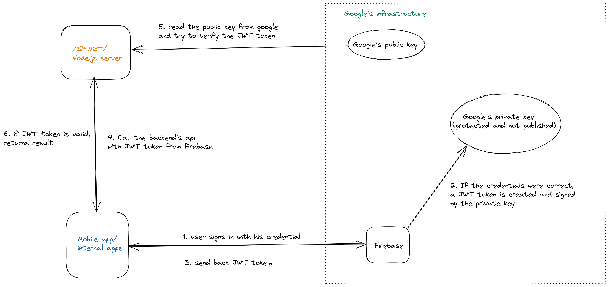

For 1.5 years, i worked for [pawtner](https://pawtner.co/) as technical lead with other 5 developers. It has been a very long journey since scratching ideas to the moment, that the app is officially available on [google play](https://play.google.com/store/apps/details?id=co.pawtner.mobileapp&hl=en&gl=US) and [app store](https://apps.apple.com/pk/app/pawtner/id1577467735). This blog post isn’t about the app, but how we built it at pawtner. There’s too much to dive deep in a single post, so with this post, i just want to make a retrospection and give you the overview of technologies, programming languages or services that we used.

## Technology overview

Here are the primary technologies used for this project:

- [MongoDB](https://www.mongodb.com/): No SQL database
- [React Native](https://reactnative.dev/): for building cross platform app using react
- [Typescript](https://www.typescriptlang.org/): Typed javascript
- [React Query](https://react-query.tanstack.com/): a powerful library for handling server state in react
- [ASP.NET](https://docs.microsoft.com/en-us/aspnet/core/?view=aspnetcore-6.0): web framework to build web app with C#
- [Express](https://expressjs.com/): Node server framework
- [Apollo serve](https://www.apollographql.com/docs/apollo-server/)r: for building graphql server
- [Redis](https://redis.io/): In-memory database–key/value store.
- [GraphQL](https://graphql.org/): A query language for API (GraphQL is not 100% used at pawtner)
- [Docker](https://www.docker.com/): to containerize your application

Here are the primary services used at pawtner:

- [Azure](https://azure.microsoft.com/en-us/): cloud services from microsoft
- [Firebase](https://firebase.google.com/): a platform developed by Google. Firebase is used for multiple important features: authentication, real time update, hosting,...
- [Expo](https://docs.expo.dev/): a platform that makes app-development with react native easier
- [Stripe](https://stripe.com/en-de): a financial service that offers online payment processing
- [SendGrid](https://sendgrid.com/): an email delivery service

## Database

I’m not going into the battle between SQL and no-SQL databases. Both them have their advantages and trade-off. SQL databases is always my personal preference, but in pawtner `MongoDB` is the more suitable candidate because of its flexibility. We shipped out new features every month, the requirements change frequently so does the database schema, that’s why `MongoDB` is our primary database.

For the data, that we retrieve or check frequently such as session tokens and user permissions we also need an intermediary data store. For this purpose, we use Redis.

### Data visualization

For a young and growing product, analyzing data and end’s user behavior plays an important role both in marketing and designing new features. Because i don’t have experience with any business intelligence tool like _PowerBI, Tableau_,.. i need a simple, straightforward solution for developers, with that my database knowledge can be easily applied. [MongoDB Charts](https://docs.mongodb.com/charts/) proved to be the perfect solution for our use cas. With MongoDB Charts we can write your own queries or even aggregation pipelines and then generate multiple charts easily. Here’s a basic example how we used MongoDB Charts to visualize our data at pawtner.

## Frontend framework: React Native

**_React native + typescript_** might be the wisest decision we made at pawtner. As a react developer, you will not have too much difficulties to get started with react native. All your valuable knowledge in react: `jsx`, `components and props`, `hooks`,... will be the same in react native. Instead of web api, you have to learn some new APIs for mobile devices and [React Native’s documentation](https://reactnative.dev/) is a perfect resource to learn them.

### React query

After a quite long time getting frustrated with the finding for the right tool of state management in react, `react query` will become my tool. It’s important to separate your application’s state into **server state** and **client state**. React query is a powerful library to handle fetching, caching, synchronizing and updating server state. With the help of this library, our client state can be handled with React’s `Context` and `useState` without installing any other external library. The only minus point for this library is the usage with graphql is not straightforward as other graphql clients such as `Apollo client` or `urql`

## Backend framework: [ASP.NET](http://ASP.NET) core

Before joining pawtner, i was a full-time _node.js_ developer with a little bit experience with C# but most of backend teams use C# as their primary programming language, so [ASP.NET](http://ASP.NET) and C# was chosen for our backend server. After a while working with it, i’m surprised how powerful is this framework. Every feature you need for a modern server: authentication, authorization, dependency injection, orm, logging,.. is already included in ASP.NET. On the other hand, with a traditional express server, you have to decide what to use and install tons of external library: should we use _passport,_ what kind of orm should be used: _mongoose, prisma or mikro-orm_,...

I also experienced [Hot Chocolate](https://chillicream.com/docs/hotchocolate) to build a graphql server and this was so impressive. Every advanced features needed for a graphql server: schema-first, authentication, dataloader, offset-based pagination,... can be handled by _Hot Chocolate._ In node.js ecosystem, you’ll need much more effort to achieve those things.

C# and [ASP.NET](http://ASP.NET) core are great and worth to learn. My only pain while working with C# is its combination with `MongoDB`. C# is a strictly typed language and `MongoDB` is famous for its flexibility, so in my opinion, this’s not a wise combination, especially when you have to write `Aggregation` in C#. At that moment, i really missed my beloved javascript and mongoose. Another drawback using ASP.NET core with `MongoDB` is that, you can’t make use of the awesome Entity Framework.

## GraphQL

Since the first time i started learning graphql, it’s always my first choice when building a web server. At that time we began to build _pawtner server_, `graphQL` is still a quite new concept to all of my team members, so I had to choose the traditional REST as the standard for the backend API. After around 7-8 months of development, we encountered such limitations with RESTful API:

- Lack of documentation: we used swagger to document our api. So far so good but we need a better way to map our documentation to types in frontend.
- Overfetching data: in mobile devices, which have limitation of data usage, we certainly want to avoid fetching unnecessary data.
- N+1 problem

GraphQL seems to be a perfect solution for all above problems. However, after 8 months and multiple sprints, the app’s complexity is incredible and we couldn’t manage switching from RESTful to graphql due to the lack of time and human resources. Luckily we could still use `graphQL` for some internal apps at pawtner.

## Authentication

Our backend API is protected by **Firebase Authentication.** Here is the authentication flow with firebase

**Firebase Authentication** is a very powerful service, which offers you email authentication, social sign and authentication with mobile phone. Unfortunately the service doesn’t offer authorization, so our backend api has to handle authorization by itself.

At the beginning, we planed to use **azure active directory (azure AD),** because we’re using **azure** for cloud computing services and **azure AD** also provides authorization. However, by using **azure AD,** we didn’t have so much flexibility to customize the login page. It has to follow microsoft’s design strictly, so it didn’t fit with our requirements so well.

## Microsoft azure

At pawtner, **microsoft azure** is our cloud provider. We use multiple services from azure: blob storage, app services, cosmos db,... One lesson i learned after managing multiple resources at pawtner ist that: Don’t do it manually. As the app grows, you use more and more services and each services needs to be configured for different environment: staging, testing, production,... It’s very difficult to manage your cloud resources manually. We should better use infrastructure as code tool ([Terraform](https://www.terraform.io/)) as soon as possible before your resources go out of control.

## CI/CD

We use **Git and Github** for code’s version control so we used [github actions](https://github.com/features/actions) as the continuous integration and continuous deployment platform. So far, i’m quite happy with this tool, it fulfill most of our requirements and can be integrated quite well with azure.

## Online payment and subscription

The last and the most important thing for a business is to accept payment. We chose stripe for the following reason:

- online payment in multiple countries (Singapore and Malaysia).
- diverse payment methods. So far the following payment methods are acceptable in pawtner: visa card, master card and grabpay.
- react native support

Since expo sdk 41, stripe is officially supported by expo. With the release of [stripe library](https://docs.expo.dev/versions/v42.0.0/sdk/stripe/), online payment can be enabled directly your native android or ios app. At pawtner, as we started to implementing the payment flow before expo sdk 41 was released, our setup is quite a little bit. We use [Checkout](https://stripe.com/docs/payments/checkout) from stripe to implement the online payment. Here’s how the payment flow works

## Conclusion

By going through this long journey, I’ve learned so many things and I’ve made a tons of mistakes too. However, it was so satisfying to see that more and more people gradually use our materialized ideas. Hope my story gives you a better overview of modern technologies and services, maybe that’s helpful for your next product.
