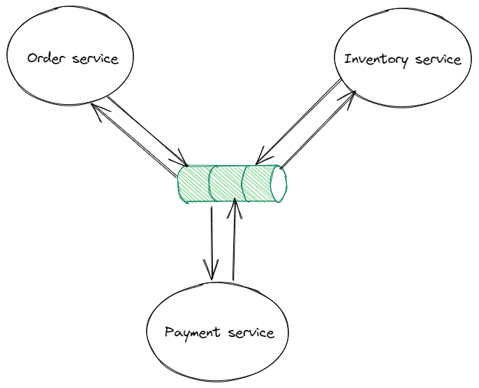

# Saga pattern

In this [blog post](https://kkhanhluu.github.io/what-is-cloud-native/), we already mentioned **microservices architecture** as a solution for building software by spiliting the system into more smaller and loosely coupled components. One of the most challenging problems while building such highly distributed system is managing transactions across multiple services. One approach that has gained popularity in recent years is the Saga Pattern. In this blog post, we will explore what the Saga Pattern is, how it works, and its benefits and drawbacks.

# Context and problem

In a traditional architectures, local ACID transactions are used to ensure data consistency. Implementing the same operation in a **microservices architecture** is much more complicated because the data is scattered around various services. In the example of my [e-shop demo](https://kkhanhluu.github.io/e-shop), the `createOrder` operation accesses data in numerous services. It reads data from `User Service` , `Product Service` and updates data in `Inventory Service`, `Order Service` and `Payment Service`. Local ACID transaction can’t be used because we have multiple databases, therefore we need a mechanism to maintain data consistency across those databases. **Saga pattern** is one of good approaches for this problem. 

# Saga pattern

A saga is a sequence of transactions that update each service’s local database and publishes a message or event to trigger the next transaction step. If a step fails, the saga executes compensating transactions that counteract the preceding transactions. 

There are two common was of coordination sagas: **choreography** and **orchestration**

## Choreography

**Choreography** is a way to coordinate sagas where participants exchange events **without** a centralized point of control. Each local transaction publishes event or message that triggers local transaction in other services

### Benefits

- **Simplicity:** Services publish events directly when they update data
- **No single point of failure:** because the responsibilities are distributed across the participants.

### Drawbacks

- **More difficult to understand:** In a complicated workflow, it’s sometimes difficult to understand how a given saga works or add a new step to the existing saga because a centralized logic is missing.
- **Cyclic dependencies between services**

## Orchestration-based saga

**Orchestration** is a way to coordinate sagas where participants exchange events **with** a centralized point of control. To execute a step, the orchestrator sends a command message to a participant. After the operation is executed, the participant sends a reply message to orchestrator. The orchestrator then processes message and send message to the next participant in case of success or executes compensating transaction in case of the operation failed. 

### Benefits

- **Simpler dependencies**: The orchestrator invokes the participant but not vice versa. As a result, there are no cyclic dependencies.
- **Improve separation of concerns and simplifies the business logic:** with the introduction of a centralized saga orchestrator, the services don’t have to care about the saga logic anymore. They just focus on business logic and therefore we are following the letter S in SOLID principle. It’s also easier for developers to understand the whole saga flow because we just have to look at the code of one single component.

### Drawbacks

- **Additional complexity:** Implementing saga orchestrator of course requires additional design complexity.
- **Single point failure:** because the orchestrators manages the complete workflow

# Summary

The Saga Pattern is a distributed transaction management pattern that provides an approach to handle long-lived transactions in a distributed environment. Simple sagas can use choreography, but orchestration is usually a better approach for complex sagas. If you want to have a real-world example of saga pattern, feel free to check out my [e-shop project](https://kkhanhluu.github.io/e-shop/explore/code/saga-pattern). It leverages [spring state machine](https://docs.spring.io/spring-statemachine/docs/current/reference/) to implement a orchestrator-based saga