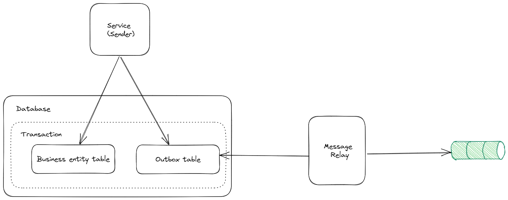

# Transactional outbox pattern

# Context and problem

In context of a microservices architecture, a service typically needs to update data and database and then send message to message broker. For example, in saga pattern, which was discussed in [the previous post](https://kkhanhluu.github.io/saga/), after updating database, a service sends message to the next participant in saga or to saga orchestrator. Because this action spans across two components: **database** and **message broker**, it’s possible that service cannot publish message to broker after updating its own database due to various reasons: network error, message broker is unavailable,…

The simplest approach for this problem is to send message in the middle of a local ACID database transaction. However, there’s no guarantee that the transaction will commit if sending messages always fail. Similarly, if a service sends a message after committing the transaction there’s no guarantee that it won’t crash before sending the message.  As a result, we need a mechanism to update database and send message atomically in order to avoid bug and inconsistency. 

# Transactional outbox pattern

The transactional outbox pattern is a technique that writes the event to an outbox within the same database transaction that triggers the event. The outbox acts as a buffer that holds the events until they can be reliably published to the message broker or event bus. The event is then published asynchronously by a separate background process **(message relay)** that reads from the outbox and publishes the events to the message broker or event bus.

The participants in this pattern are: 

- **Sender**: the service that sends the message.
- **Database**: the sender’s database that stores business data and message outbox.
- **Message outbox**: a table or any storage that stores the messages to be sent.
- **Message relay:** a component that is responsible for sending messages stored in **outbox** to message broker.

## Message outbox

The implementation for the message outbox can be very different. It can be a separate table, that’s just responsible for storing messages to be sent. In some other cases, the outbox is just a property of each database record. 

## Message relay

There are two patterns for implementing message relay: 

- **Polling publisher**
- **Transaction log tailing**

### Polling publisher

It’s a component that keeps polling the outbox in database and publishes messages. Polling works quite well at low scale, however frequently polling the database does not fit well in a large scale. You can checkout an example of a polling publisher in my [e-shop project](https://kkhanhluu.github.io/e-shop/explore/code/transactional-outbox-pattern), which implement message relay as a cronjob that run at a scheduled pace. 

### Transaction log tailing

Every update made to database is represented as an entry in database’s transaction log. In this pattern, we implement the message replay as a transaction log miner, which reads the transaction log entities, converts those entities to corresponding message inserted to database and then sends those message to message broker. The mechanism for tailing the transaction log depends on the database: WAL for Postgres, binlog for MySQL,…

# Summary

The transactional outbox pattern is a pattern where events are written to an outbox within the same database transaction as the business transaction. This decouples the transactional semantics from event publishing, ensuring reliable event delivery even in the face of failures. **Message relay** is a important component in transactional outbox pattern and can be implemented by using **polling publisher** or **transaction log tailing.**