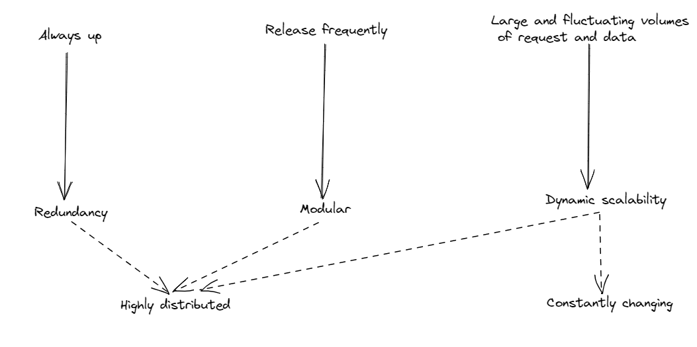

# What is cloud native

“Cloud-native” is one the most popular buzzwords that you can come across as a software engineer. This articles will discuss some key takeaways to know about “cloud-native” term, why does it matter and how is it different from “microservices architecture”.

## Today’s application requirements

The ubiquity of internet has pushed the boundaries of user’s expectation to the application that they use daily. Here are some key requirements for any popular applications:

### Zero downtime

Gone are the days when even short maintenance windows during which applications are unavailable are tolerated. Nowadays, applications are expected to be available 24/7 without any downtime.

### Frequent software releases

Users are excited for whizzbang new features. Developers want to release a feature as soon as possible and get a quick feedback. In order to do release software more frequently, we need an architecture that enables agility and helps us to build the software more robustly.

### Great number of connected devices

Gone are the days that we only have PC and laptop connected to internet. Nowadays, apart from PC and laptop, an application must be support at least two mobile device platforms, iOS and Android, desktop app, tablet,… In some cases, sensors and devices such as cameras, thermostats,… must also be supported. That means two requirements. First, the number of requests sent to the system increase so the system must adapt to expanding demands. Second, the volume of data flowing over internet has significantly increased.

## Characteristics of a modern application

In order to fulfill all above mentioned requirements, a modern application need to have following characteristics:

- \***\*\*\*\*\***\*\*\*\*\***\*\*\*\*\***Redundancy:\***\*\*\*\*\***\*\*\*\*\***\*\*\*\*\*** In order to ensure the system to be up 24/7, we need to have a system with redundant nodes to compensate for inevitable failures.
- \***\*\*\*\*\***\*\*\*\*\***\*\*\*\*\***Modularity:\***\*\*\*\*\***\*\*\*\*\***\*\*\*\*\*** The goal here is to release code frequenetly. A monolith application with many closely interrelated modules doesn’t allow this. In recent time, it’s been proven that software made up of smaller, loosely coupled and indepently deployable components enables more flexible release model. This architecture is often called \***\*\*\*\*\*\***microservices.\***\*\*\*\*\*\***
- **\*\*\*\***\*\*\*\***\*\*\*\***\*\***\*\*\*\***\*\*\*\***\*\*\*\***Dynamic scalability:**\*\*\*\***\*\*\*\***\*\*\*\***\*\***\*\*\*\***\*\*\*\***\*\*\*\*** As a result of tidal waves of requests and data volumes, the software is required to be scaled dynamically. The resources need to be scaled up in rush hours and scaled down in other circumstances.

The picture below was taken from the book “Cloud native patterns”, depicts the core characteristics of a cloud-native software based on its requirements

## Definition of cloud-native

All those requirements, characteristics along with the availability of new platform on which you can run the software, lead to a new architectural style for software: \***\*\*\*\***cloud-navtive\***\*\*\*\***

> **Cloud-native software is highly distributed, must operate in a constantly changing environment, and is itself constantly changing.**

## Cloud vs cloud-native

Let’s take a closer look at “cloud-native” definition. The software must operate in a constantly changing environment and `cloud` is a constantly changing environment. When you have a “cloud-native” software, your software will run well in `cloud`. You might say that this software feels quite at home in the cloud. It’s native of that land.

> `Cloud` is about _where_ we’re computing. `Cloud-native` is about _how_

## Cloud vs microservices

One of the requirements for cloud-native software is the modularity. Microservices architecture allows for the creation of modular, independently deployable components by breaking a monolithic application into smaller components. Therefore, cloud native and microservices are very related concepts. They should go hand-in-hand, but it is possible to have a microservices-based application that is not cloud native
